# CpuRayTracer

## Made in CAP4730: Computer Graphics at the University of Florida

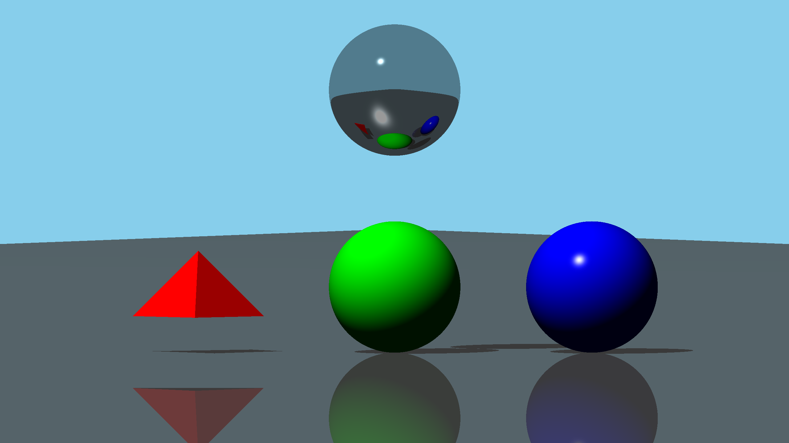

### Features
- Diffuse Shading
- Specular Shading
- Ambient lighting
- Shadows
- Reflections
- Multiple Lights
- Spheres and Triangle Meshes (Example being a tetrahedron)
- Multi-Threading
- Export individual frames or interpolate between two points with animation
- Real time viewport
- Configurable background, resolution and recursion depth

### Compilation Instructions
**Windows**
1. Clone this repo using  
`git clone https://github.com/haroonsyed/CpuRayTracer.git --recursive`
2. Install cmake
3. Open the folder containing repo in visual studio

    or

3. Run `cmake ..`
4. Open generated solution in visual studio and run main.cpp

**Linux**
1. Clone this repo using  
`git clone https://github.com/haroonsyed/CpuRayTracer.git --recursive`
2. Install the following dependencies: 
libxmu-dev libxi-dev libgl-dev libxinerama-dev libxcursor-dev xorg-dev libglu1-mesa-dev
3. Install cmake
4. CD into build folder and run `cmake ..`
5. Run `make` to build your executable
6. Run `./main` 

### Operation Guide
Press `P` to toggle perspective between perspective and orthographic views.

Press `ESC` key to close program.

## Scene1
- The default scene consists of a tetrahedron, and two colored spheres lined up along the y axis. A mirror sphere floats above the other objects. A floor is below with a sky-blue background.
- Directional light is created by adding a light far away, in this case at -3000,2000,4000. This gives the light a downward angle at slightly more sideways than backwards from the point of view of the camera.
- The camera is located close to the origin at (-40,0,0)
- The floor is a large triangle in the scene. It is white, but has a low diffuse value, which coupled with the low light angle causes the floor to appear darker. It has a specular, which can be seen in the reflection of the mirror ball. The floor itself is reflective, which shows the other objects above.

- The tetrahedron is diffuse red and has a slight specular to it (which is not visible in the image). It consists of four triangle meshes.
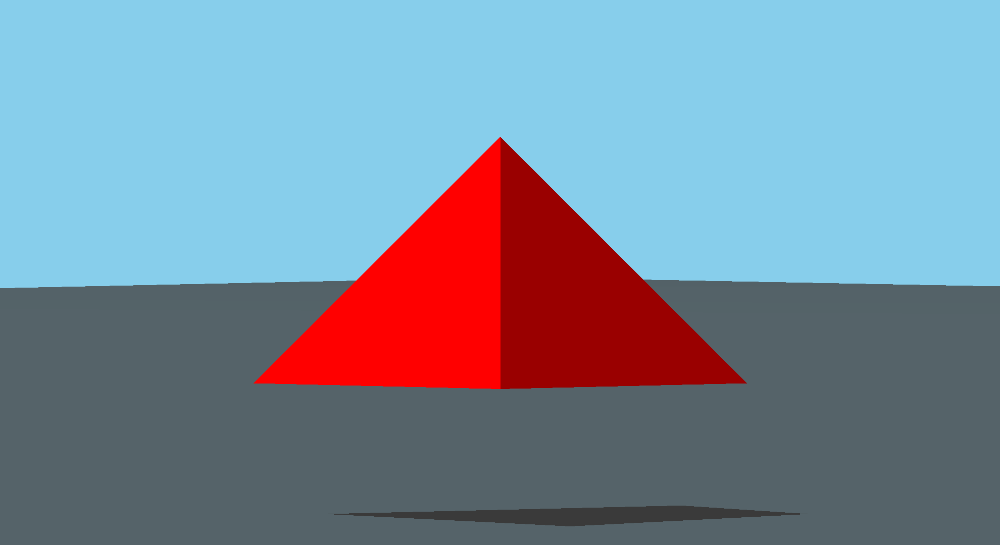
- The green sphere is a pure diffuse material, which shows the shadows on the bottom side where light is occluded really well.
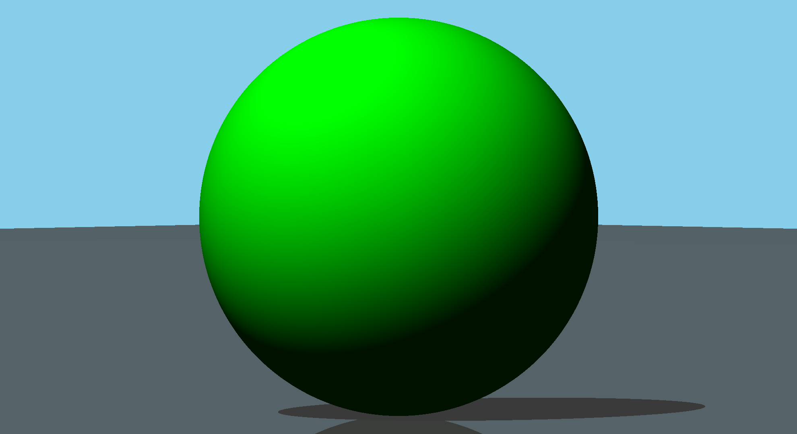
- The blue sphere has a high specular value, which attempts to mimic a more plastic material.
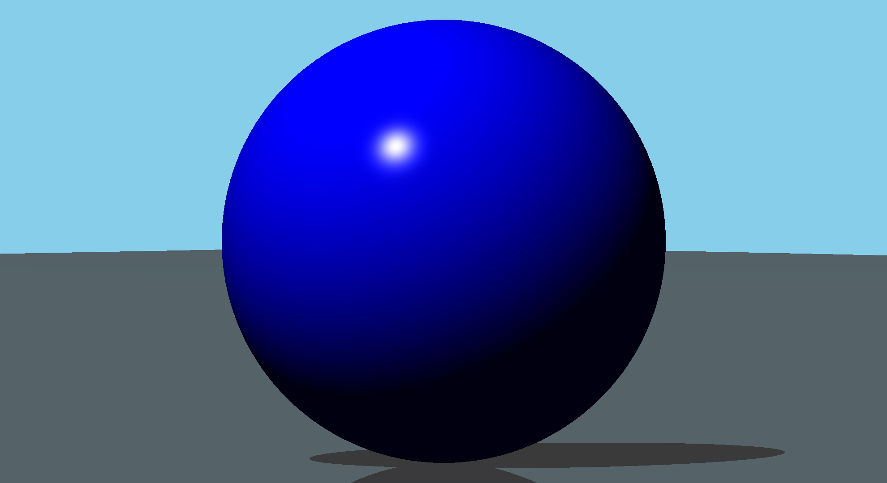
- The mirror sphere is interesting in that it shows the other spheres reflected and curved accurately. It also has a slight specular. And separately shows the floor specular toward the light source.
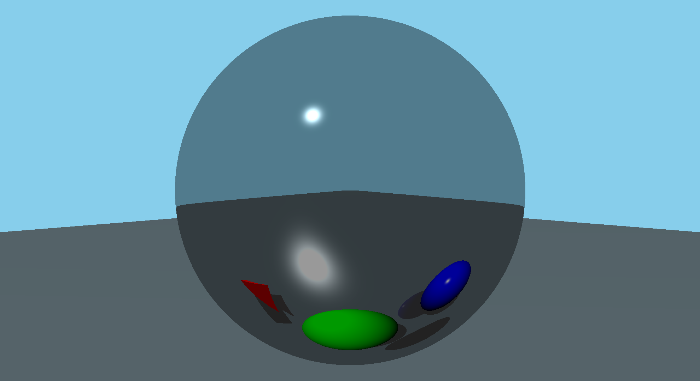

## Functionality
### Perspectives

For this scene the blue ball has been re-arranged to better show perspective.

Perspective View:
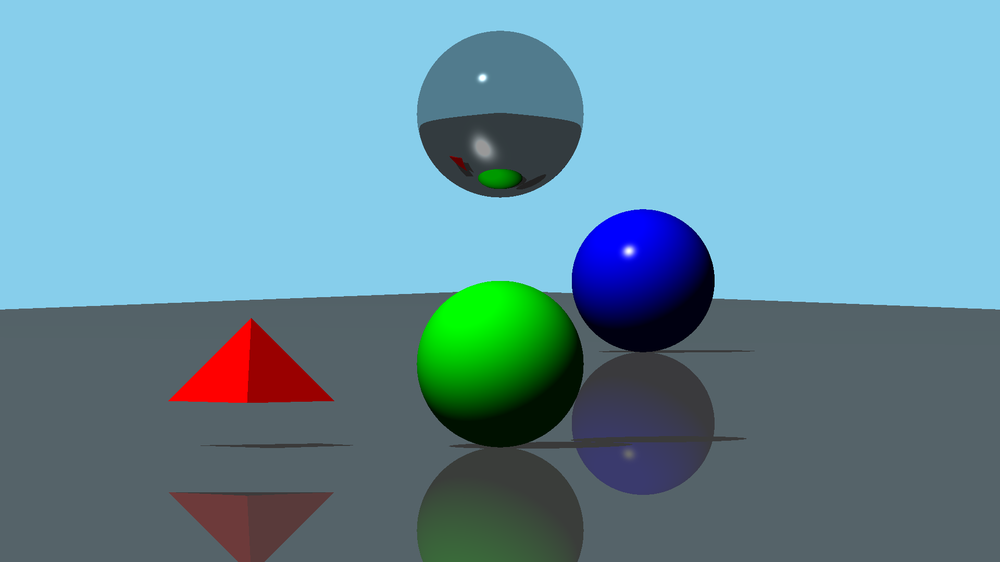

Orthographic View:
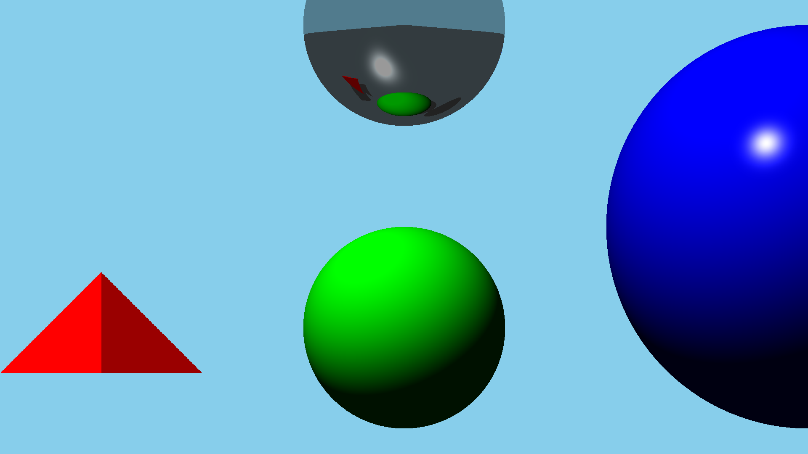

Notice how the blue ball, which has a radius twice that of the green ball appears similar in size in perspective view. But in orthographic view the parallel rays show the size difference. Also notice the floor disappears since it is in the same plane as the viewing rays, which causes infinite solutions and is treated as a non-hit (infinitely small edge to process). However these are still visible in the mirror ball reflections.

### Multiple lighting conditions possible
The examples so far have featured a directional light. 
Now let's try to simulate a point light by placing the light in the middle of all the objects:
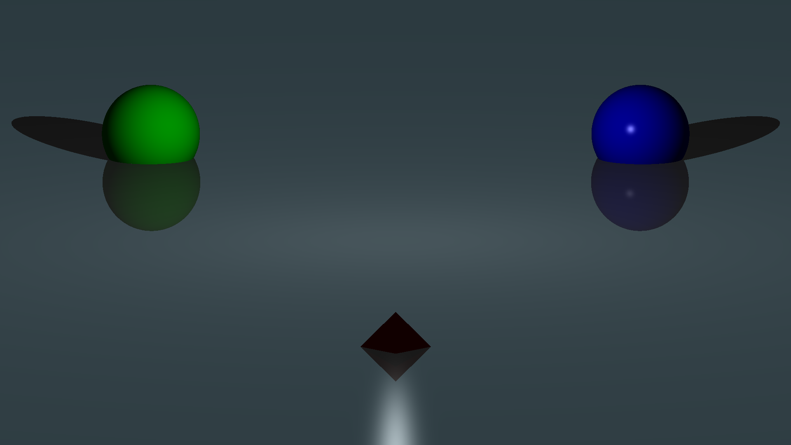
We can see clearly that the shadows and lighting orientation are relative to the direction of the light and not the same for each object. What should be noted is that the point light as implemented does not decrease in strength with distance, although this would be simple to implement.

The ray tracer supports an arbitrary number of light, given the hardware capacity. Now let's see the previous render with a directional light:
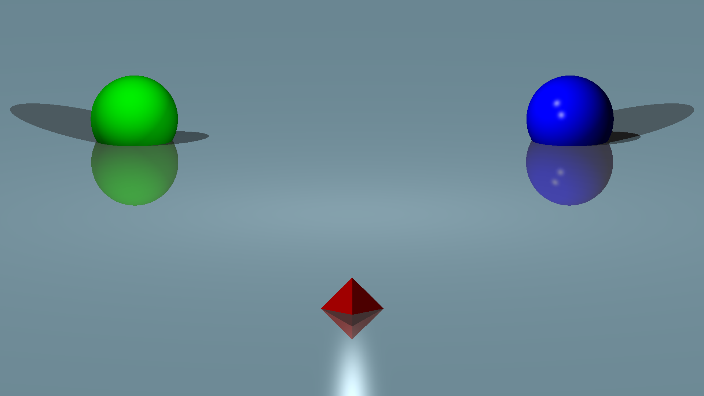
Note the double specular reflection on the blue ball. The increased brightness of the scene. The second shadows (all facing the same way), but smaller since the light is higher up. Also note how overlapping shadows correctly become even darker.

All aspects of the program are configurable, for example shadows can be enabled or disabled with the enableShadows boolean of scene.h. Relfections can be enabled or disabled with the maxRecursions value located there as well. Lights themselves can have varying intensities upon instantiation. And materials can be composed of different properties as well. Below are a couple different scenarios demonstrating this:

Diffuse Pass
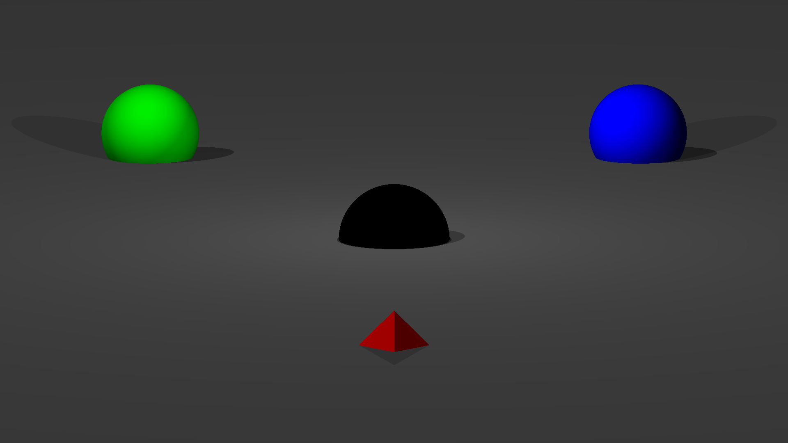

Specualar Pass
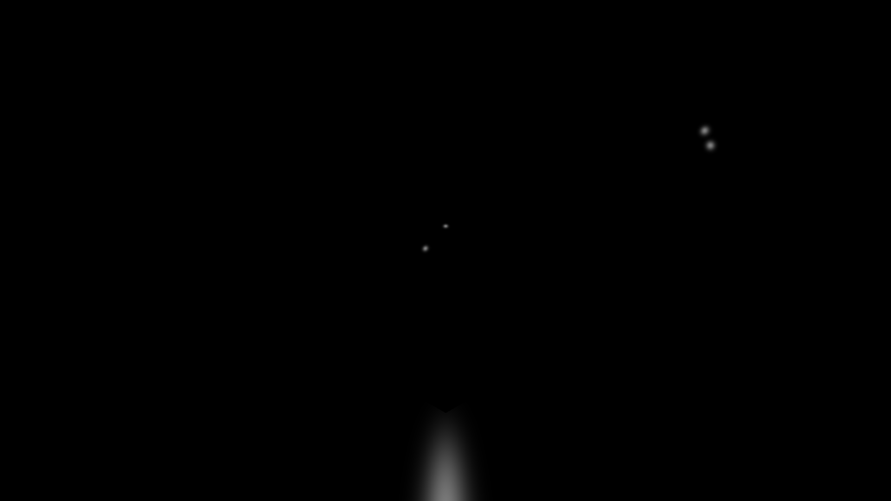

Just Ambient Light
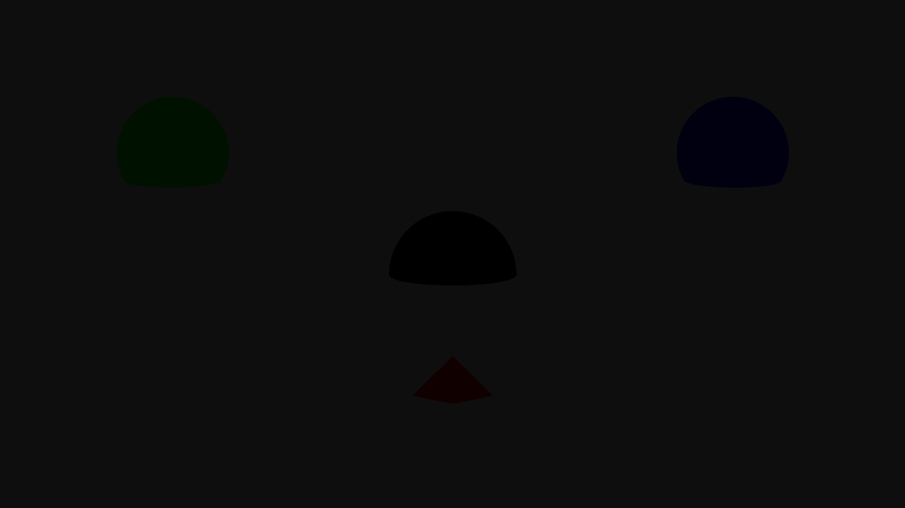

No Shadows
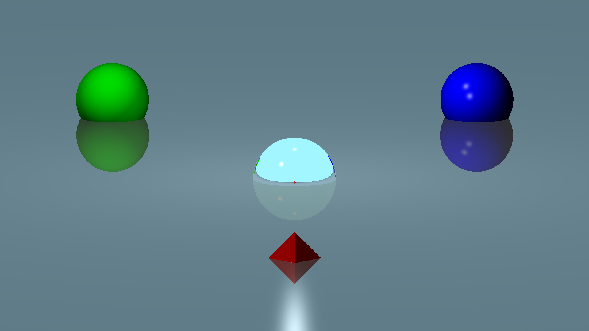

No reflections. Note how the sky color is missing from the floor as well.
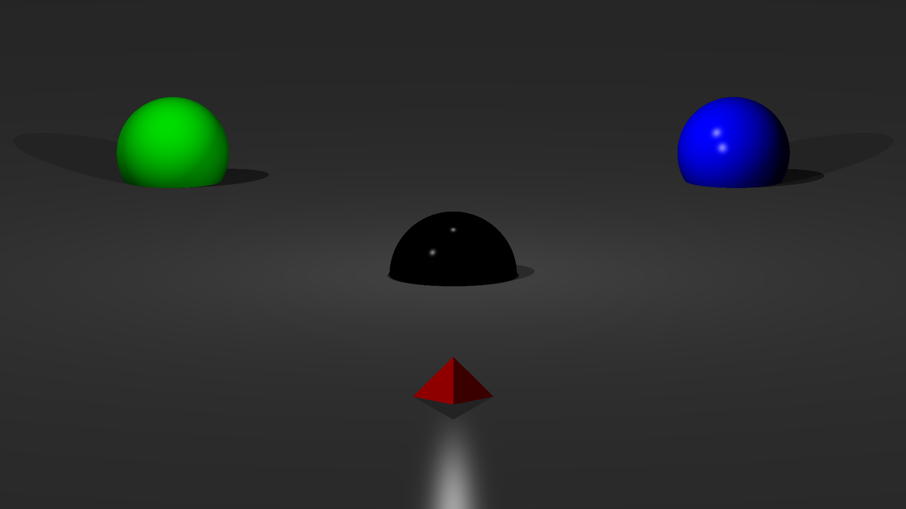

### Other Program features

MULTI-THREADING: 
The program features multithreading, and automatically uses the maximum number of threads available on the client. On my i5 8250u various timings are listed below:
 
| Thread Count | Time (ms) |
| ------------ | --------- |
| 1 | 6610 |
| 4 | 3628 |
| 5 | 2957 |
| 6 | 2544 |
| 7 | 2232 |
| 8 | 1768 | 
| 9 | 1593 | 
| 16| 809  |
One can see that the program scales well with processing power, as it should since all operations are disconnected from one another. However I suspect my multithreading implementation is not perfect, since my cpu has 8 cores and the additional threads past that continue to give performance gains. Further investigation is required.

MATHLIB: 
A basic math library was created for this project (src/math). I understand it is slow compared to using asm and sse instructions, but it was a good exercise for refreshing linear algebra knowledge.

TESTS: 
Continuous integration with github actions has been implemented. Tests were written for most features of the mathematics library. No tests were written for the ray tracing itself, as I was not sure how to do this other than visually. My initial idea was to have a verified visual image to compare against with tests, but the inevitable new features (and possible floating point variations) made this unsuitable.

 

## DISCLAIMER
THIS IS ONLY FOR DEMONSTRATION PURPOSES AND IS NOT FOR OTHER STUDENTS TAKING THE CLASS. 

I DO NOT AUTHORIZE THE USE OF THIS CODE FOR CLASS PURPOSES BY ANY STUDENT OTHER THAN MYSELF OR IN ANY FORM THAT WOULD BE CONSIDERED "CHEATING" OR "PLAGARISM". 

Please be ethical.
